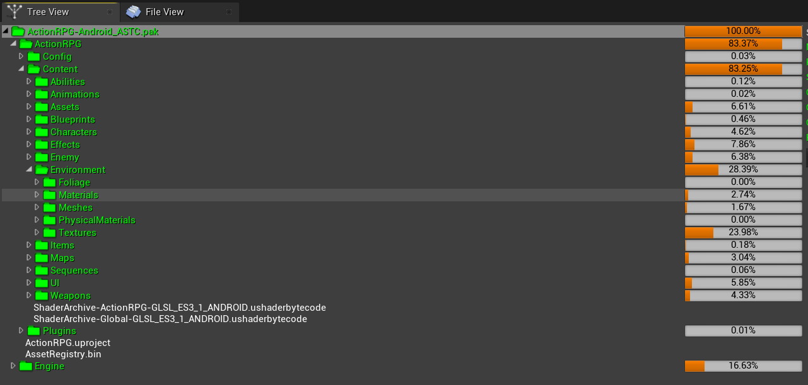
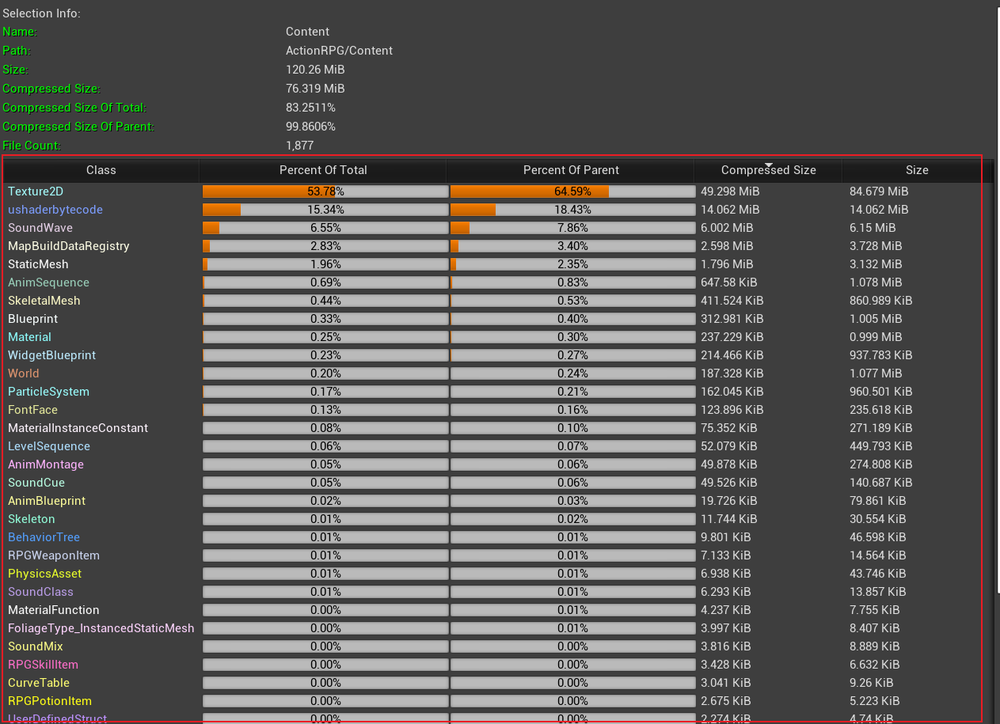
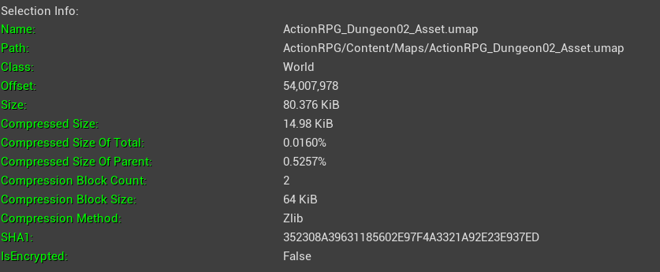
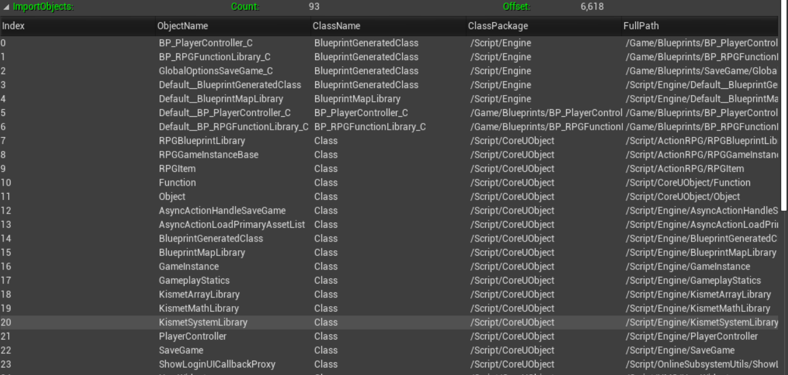
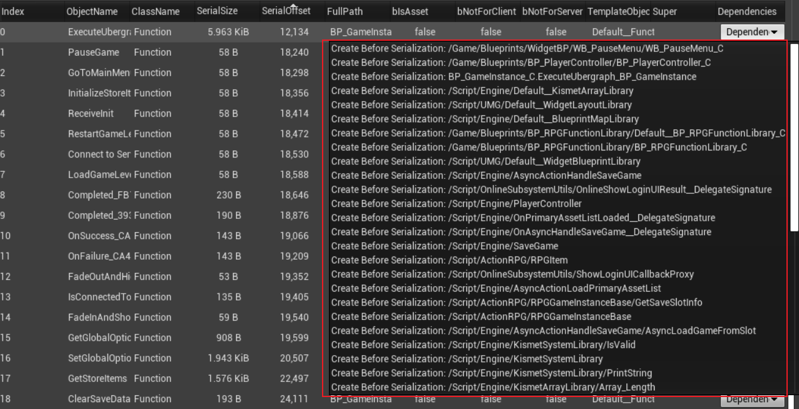
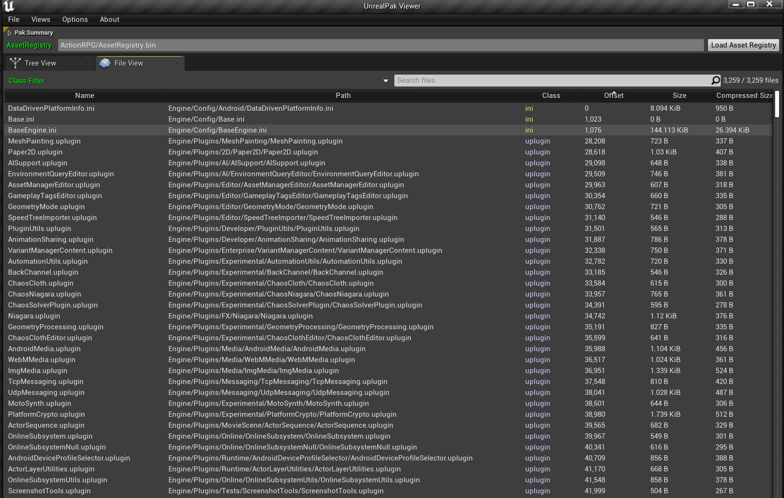
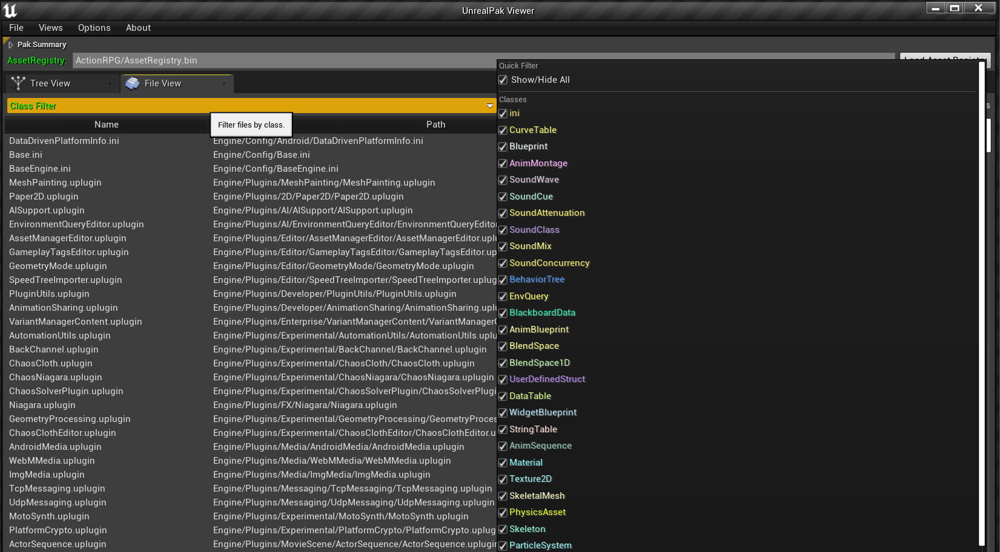
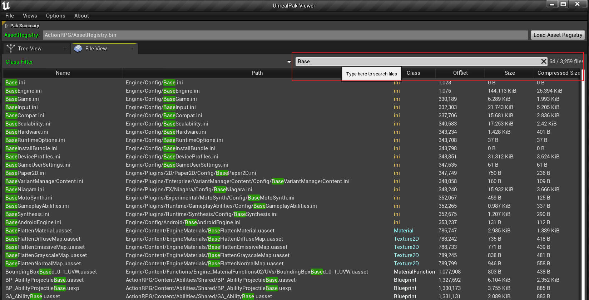

# UnrealPakViewer ##

可视化查看 Pak 文件内容，支持以下特性

* 支持树形视图和列表视图查看 Pak 中的文件
* 列表视图中支持搜索，过滤，排序
* 支持查看 UAsset 文件的具体内容组成信息
* 以百分比显示各个文件夹，文件，文件类型的大小占比
* 支持多线程解压 Pak 文件
* 支持加载 AssetRegistry.bin 资源注册表

## 功能 ##

### 打开 Pak 文件 ###

或者直接拖动 Pak 文件到 UnrealPakViewer 窗口中即可打开，如果 Pak 文件是加密的的，则会弹出密码输入框

输入对应的 AES 密钥的 Base64 格式后即可打开 Pak 文件

### 查看 Pak 文件摘要信息 ###

* Mount Point: 默认挂载点
* Pak Version: Pak 文件版本号
* Pak File Size: Pak 文件大小
* Pak File Count: Pak 内打包的文件数量
* Pak Header Size: Pak 文件头大小
* Pak Index Size: Pak 索引区大小
* Pak Index Hash: Pak 索引区哈希值
* Pak Index Is Encrypted: Pak 索引区是否加密
* Pak File Content Size: Pak 文件内容区大小
* Pak Compression Methods: Pak 中文件所使用的压缩算法

### 加载资源注册表 ###

Cook 完成后都会在 *Saved/Cooked/[Platform]/[Project]/Metadata/DevelopmentAssetRegistry.bin* 路径生成一份资源注册表信息，里面包含资源类型，引用关系等信息，可以通过 Load Asset Registry 加载进来分析各个资源类型的大小占比信息

### 文件树视图 ###

以树形结构列出 Pak 内包含的目录和文件，以及目录大小占总大小的比例信息

#### 选中某个目录后可以在右边查看该目录详情 ####

* Name: 目录名称
* Path: 目录路径
* Size: 目录解压后大小
* Compressed Size: 目录压缩后大小
* Compressed Size Of Total: 目录压缩大小占总 Pak 大小的比例
* Compressed Size Of Parent: 目录压缩大小占上级目录的比例
* File Count: 目录中文件数量

以及该目录中各个文件类型的占比信息(需要加载 AssetRegistry.bin 注册表)

#### 选中文件后可以在右边查看该文件详情 ####

相比目录，额外多一些信息

* Class: 文件类型
* Offset: 文件在 Pak 中序列化的起始位置
* Compression Block Count: 压缩分块数量
* Compression Block Size: 压缩分块大小
* Compression Method: 文件压缩算法
* SHA1: 文件哈希值
* IsEncrypted: 文件是否加密

如果选中的是 .uasset 或者 .umap 文件，还能查看该文件内部的序列化信息

* Guid: 该资源的 Guid
* bUnversioned: 序列化时是否带引擎版本信息
* FileVersionUE4: 文件格式版本号
* FileVersionLicenseeUE4: 文件格式版本号(授权)
* TotalHeaderSize: uasset 的文件头大小
* PackageFlags: uasset 包标志
* ImportObjects: 导入表信息(引用的外部对象信息)
  
  * Index: 对象在导入表中的索引
  * ObjectName: 对象名称
  * ClassName: 对象类型
  * ClassPackage: 对象类型所在的包
  * FullPath: 对象完整路径
* ExportObjects: 导出表信息(该资源内部有哪些对象)，导出表的序列化大小即是对应的 .uexp 文件大小，可点击 SerialSize 和 SerialOffset 列进行排序
  
  * Index: 对象在导出表中的索引
  * ObjectName: 对象名称
  * ClassName: 对象类型
  * SerialSize: 对象的序列化大小
  * SerialOffset: 对象的序列化偏移
  * FullPath: 对象在包内的完整路径
  * bIsAsset:
  * bNotForClient: 非客户端资源
  * bNotForServer: 非服务器资源
  * TemplateObject: 该对象的模板对象
  * Super: 父类对象
  * Dependencies: 该对象引用的具体对象信息，冒号前为引用类型，后为引用的具体对象路径
    
    * Serialization Before Serialization: 序列化前要完成序列化的对象
    * Create Before Serialization: 序列化前要完成创建的对象
    * Serialization Before Create: 创建前要完成序列化的对象
    * Create Before Create: 创建前要完成创建的对象
* Dependency packages: 该资源依赖的资源
  
* Dependent packages: 依赖该资源的资源，这个是在当前 Pak 内搜索，如果分包了则结果可能会缺失
  
* Names: 该资源相关联的所有 FName 信息
  

#### 右键菜单 ####

右键目录或者文件，会弹出右键菜单，功能如下

* Extract: 解压选中的目录或者文件
* Export To Json: 将选中的目录或文件信息导出到 Json 文件
* Export To Json: 将选中的目录或文件信息导出到 Csv 文件
* Show In File View: 如果选中的是文件，则跳转到该文件在文件列表中的对应位置

### 文件列表视图 ###

文件列表视图以表格形式显示 Pak 中的文件信息，支持点击列标题进行排序

#### 类型过滤 ####

按类型过滤列表中的文件

#### 文件名过滤 ####

按文件名过滤列表中的文件

#### 右键菜单 ####

选中文件后右键弹出右键菜单，功能如下

* Extract: 解压选中文件
* Export To Json: 将选中的文件信息导出到 Json 文件
* Export To Json: 将选中的文件信息导出到 Csv 文件
* Show In Tree View: 如果选中单文件，则跳转到树形视图中
* Copy Columns: 复制对应的列信息到剪贴板中
* View Column: 隐藏/显示列
* Show All Columns: 显示所有列

## 编译 ##

将代码克隆到 *Engine\Source\Programs* 目录下，重新生成解决方案编译即可

* 已编译通过的引擎版本
  * 4.24
  * 4.25
  * 4.26
  * 4.27
  * 4.28

## TODO ##

* support utoc, ucas
* support multi pak/ucas open
* commandline application
* Pak compare visiualize
* resource preview
* resource load heat map
